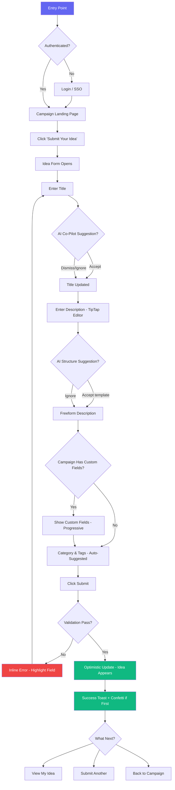
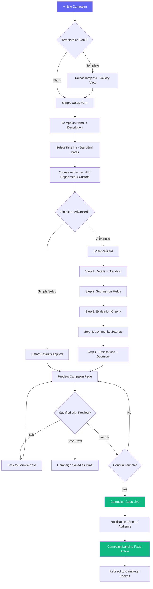
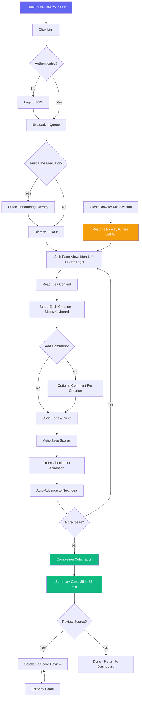
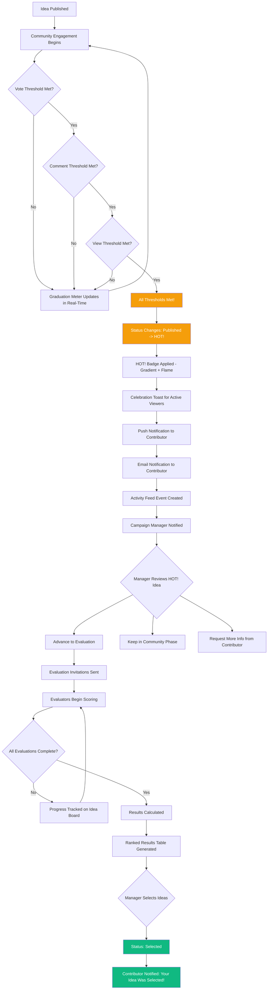

# UX Design Specification Ignite

**Author:** Cvsilab
**Date:** 2026-03-09

---

## Executive Summary

### Project Vision

Ignite is the first comprehensive open-source innovation management platform — a full-lifecycle, self-hosted alternative to HYPE Enterprise ($50K+/year). Built on Next.js 14+, tRPC, Prisma, and PostgreSQL with a "Refined Industrial" design aesthetic (Notion meets Linear meets Figma), Ignite reimagines enterprise innovation management for the modern era: faster setup, easier use, AI-native intelligence, and open-core economics.

The MVP delivers the core ideation-to-evaluation loop — campaigns, ideas, community engagement, scorecard/pairwise evaluation, idea boards, and campaign KPI dashboards — covering 80% of what 80% of HYPE customers use daily. Subsequent phases add partner engagement, strategy building, phase-gate projects, and enterprise features.

The UX north star: optimized for the "hat-wearer" — someone running innovation part-time alongside their main job. If it's easy enough for them, it's easy enough for everyone.

### Target Users

**Primary Personas:**

| Persona                    | Role                                              | Context                                                      | UX Priority                                                                      |
| -------------------------- | ------------------------------------------------- | ------------------------------------------------------------ | -------------------------------------------------------------------------------- |
| Sarah (Innovation Manager) | Runs 12 campaigns/year, proves ROI to C-suite     | May be part-time "hat-wearer" at mid-market companies        | Campaign setup < 15 min, instant KPI dashboards, zero-training onboarding        |
| Marco (Contributor)        | Field operations manager with improvement ideas   | Occasional visitor, mobile-first, 10-minute attention window | Idea submission < 3 min on mobile, visible status at every stage, feedback loops |
| Priya (Evaluator)          | R&D Director evaluating 25 ideas between meetings | Task-oriented, time-constrained, often on tablet             | 25 evaluations in 90 min, save-and-resume, minimal clicks, clear criteria        |
| James (Platform Admin)     | IT applications manager, deploys and configures   | Cares about uptime/security, not innovation workflows        | Self-service admin panel, clear separation from innovation config                |

**Secondary Personas:**

| Persona                     | Role                               | UX Priority                                               |
| --------------------------- | ---------------------------------- | --------------------------------------------------------- |
| Victoria (Campaign Sponsor) | CSO, face of the campaign          | Streamlined executive view, not full management interface |
| Ravi (Platform Operator)    | DevOps, deployment and maintenance | Docker Compose in 15 min, config via env vars             |

### Key Design Challenges

1. **Complexity management for the hat-wearer** — Enormous platform depth (campaigns, evaluation, idea boards, AI, KPIs) must be progressively disclosed. Simple setup with smart defaults for day-one; advanced configuration available but never mandatory. Campaign creation target: under 15 minutes vs. HYPE's 45-60 minutes.

2. **Participation momentum** — The "digital suggestion box" problem kills innovation programs. The UX must create visible feedback loops at every stage: status changes, notifications, HOT! graduation, community ranking, and sponsor engagement signals. Contributors must see their ideas are alive, not lost.

3. **Evaluator fatigue** — If the evaluation flow feels heavy, evaluators go dark and the funnel stalls. Requires ruthlessly efficient UX: one-view context, minimal clicks, save-and-resume, keyboard navigation, progress visibility.

4. **Multi-persona navigation** — Innovation Managers (power users), Contributors (occasional visitors), Evaluators (task-oriented), and Admins (configuration-only) all share the same platform. Navigation, dashboards, and task routing must adapt to role context.

5. **Mobile-first contributor experience** — Campaign pages, idea submission, idea detail, discussion, and evaluation forms must be fully functional at 375px. Manager-heavy features (idea board, cockpit, wizard) are desktop-optimized.

### Design Opportunities

1. **Campaign cockpit as conversion moment** — Sarah's "aha" is walking into a quarterly review with auto-generated ROI dashboards. Beautiful, instantly shareable KPI visualizations drive pilot-to-adoption conversion.

2. **AI co-pilot as competitive moat** — No competitor offers AI-native idea enrichment during submission. Subtle quality improvement (suggestions, tags, similar detection) without intrusion becomes the feature contributors talk about.

3. **HOT! status as engagement engine** — Community graduation (visible progress bars, threshold tracking, flame badge, celebration moment) drives the social proof that triggers participation cascades.

4. **Linear/Notion-quality polish as positioning** — The Indigo + Amber design system with Satoshi typography and warm grays already signals modern SaaS. Pushing to best-in-class micro-interactions makes the screenshot comparison with HYPE instantly compelling.

## Core User Experience

### Defining Experience

The core experience loop for Ignite is the **Innovation Flywheel**: Contributor submits idea > Community engages (comments, votes) > Idea graduates to HOT! > Evaluator scores > Manager selects > Implementation happens > Contributor sees result > Contributor submits next idea. If any link breaks, participation drops and the program dies. The UX must make every link feel alive.

The primary interaction to perfect: **idea submission and feedback loop**. The contributor must submit in under 3 minutes AND see visible progress at every stage afterward. This is the heartbeat of the platform.

The secondary critical interaction: **campaign setup and cockpit**. If the Innovation Manager can't stand up a campaign quickly and show results easily, no campaigns exist for contributors to submit to.

### Platform Strategy

| Dimension               | Decision                                                                    | Rationale                                                                        |
| ----------------------- | --------------------------------------------------------------------------- | -------------------------------------------------------------------------------- |
| Primary platform        | Web-first responsive                                                        | No native mobile app in MVP. Responsive web down to 375px for contributor flows. |
| Desktop-optimized views | Idea board, campaign wizard, evaluation results, cockpit, admin             | Power-user tools that don't need mobile optimization                             |
| Touch support           | Evaluation forms on tablet, idea voting/commenting                          | Priya evaluates between meetings on tablet                                       |
| Keyboard support        | Cmd+K command palette, evaluation keyboard shortcuts, idea board navigation | Power user accelerators matching Linear/Notion patterns                          |
| Offline                 | Not required                                                                | Innovation management is inherently collaborative and real-time                  |
| Real-time               | Socket.io for live notifications, activity feeds, idea submission events    | "Show the pulse" principle demands real-time updates                             |

### Effortless Interactions

| Interaction               | Time Target                        | Design Approach                                                                    |
| ------------------------- | ---------------------------------- | ---------------------------------------------------------------------------------- |
| Idea submission           | < 3 min on mobile                  | Title + description + submit. Custom fields progressive. AI co-pilot non-blocking. |
| Campaign setup (simple)   | < 15 min first time                | Smart defaults for 80% of cases. Copy-from-template for repeats.                   |
| Campaign setup (advanced) | < 30 min first time                | 5-step wizard with progress sidebar. Each step independently saveable.             |
| Evaluation completion     | 25 ideas in 90 min (~3.5 min/idea) | One-view layout: idea left, form right. [Done & Next] flow. Progress bar.          |
| Finding relevant content  | < 5 seconds                        | Dashboard surfaces tasks + trending + active. Cmd+K for everything.                |
| Understanding idea status | Zero effort                        | Status badge everywhere. Activity timeline. Email notifications on transitions.    |
| KPI reporting             | Automatic                          | Campaign cockpit auto-generates. No export/PowerPoint required. Shareable links.   |

### Critical Success Moments

1. **First idea gets feedback** — Within 48 hours of submission: coach feedback, community comment, or status change. The UX pushes notifications and makes activity visible. If Marco hears nothing for a week, he never returns.

2. **HOT! graduation** — The moment an idea hits all community thresholds and earns the flame badge. Toast notification, subtle animation, visible status change across the campaign community. This is the engagement flywheel trigger.

3. **Campaign cockpit reveal** — Sarah opens the cockpit and sees participation rates, idea funnels, and engagement trends without building a single chart. "I can actually show this to leadership" — the pilot-to-adoption conversion moment.

4. **Evaluation complete on time** — Evaluation invitations sent, evaluators complete within deadline, results appear in ranked table with bubble chart. If this works smoothly once, Sarah becomes a platform champion.

5. **First-time campaign launch** — Campaign goes live to 500 employees with polished landing page, notifications sent, countdown timer ticking. The moment the tool feels real.

### Experience Principles

1. **"Show the pulse"** — At every level (dashboard, campaign, idea), show that innovation is alive and moving. Activity feeds, participation bars, status badges, HOT! flames, recent activity. Never let the platform feel static or abandoned.

2. **"Three minutes or less"** — Any contributor action (submit idea, vote, comment, like) must complete in under 3 minutes. Time-to-value for contributors is measured in seconds, not minutes.

3. **"Smart defaults, power available"** — Simple Setup covers 80% of campaigns. One-click evaluation templates. Auto-generated dashboards. Every default is overridable for power users who need control.

4. **"Never a dead end"** — Every screen has a clear next action. Empty states guide to first steps. Ideas always show "what happens next." Evaluators always see progress and queue depth.

5. **"The dashboard tells the story"** — Innovation Managers never need PowerPoint. Campaign cockpits, KPI reports, and idea funnels auto-generate visual narratives from platform data.

## Desired Emotional Response

### Primary Emotional Goals

| Persona                     | Target Emotion          | Trigger                                             | Competitor Anti-Pattern                                     |
| --------------------------- | ----------------------- | --------------------------------------------------- | ----------------------------------------------------------- |
| Sarah (Innovation Manager)  | Empowered and credible  | Auto-generated KPI cockpit, polished campaign pages | Overwhelmed by complex wizard, embarrassed by ugly defaults |
| Marco (Contributor)         | Heard and valued        | Status updates, coach feedback, HOT! graduation     | Ignored (black hole), cynical ("nothing changes")           |
| Priya (Evaluator)           | Efficient and respected | Clear criteria, fast flow, progress visibility      | Annoyed (too many clicks), confused (unclear criteria)      |
| Victoria (Campaign Sponsor) | Proud and engaged       | Activity stats, trending ideas, community energy    | Disconnected (never logs in), skeptical (can't see results) |

### Emotional Journey Mapping

| Stage                    | Target Feeling           | Design Implication                                                                                                        |
| ------------------------ | ------------------------ | ------------------------------------------------------------------------------------------------------------------------- |
| First discovery          | Impressed, curious       | Modern gradient banners, Satoshi typography, clean cards. First screenshot communicates "not enterprise Java from 2015."  |
| First idea submission    | Confident, guided        | Clear campaign CTA, simple form, AI co-pilot suggestions, immediate confirmation with "what happens next."                |
| Waiting after submission | Patient but informed     | Visible status badge, notification on status change, email digest showing activity. Opposite of a black hole.             |
| HOT! graduation          | Thrilled, validated      | Celebration toast, flame animation, visible community reaction, push notification. Dopamine hit that drives the flywheel. |
| Evaluation sprint        | Focused, making progress | Progress bar ("12 of 25"), one-view layout, [Done & Next] momentum, completion celebration.                               |
| Cockpit review           | Confident, prepared      | Auto-generated charts, shareable links, benchmark comparisons, print-ready layouts.                                       |
| Error states             | Supported, not blamed    | Friendly error messages with recovery actions, inline validation, undo capabilities, draft auto-save.                     |

### Micro-Emotions

| Target State   | Design Approach                                                          | Opposing State to Prevent |
| -------------- | ------------------------------------------------------------------------ | ------------------------- |
| Confidence     | Clear wayfinding, consistent patterns, always-visible next action        | Confusion                 |
| Trust          | Enterprise-grade polish, proper loading states, no layout shifts         | Skepticism                |
| Momentum       | Every action moves forward, progress bars, [Done & Next] flows           | Stagnation                |
| Belonging      | Community rankings, @mentions, activity feeds, contributor profiles      | Isolation                 |
| Accomplishment | Clear completion signals, success toasts, progress tracking              | Frustration               |
| Delight        | HOT! animations, smooth micro-interactions, AI suggestions that surprise | Tedium                    |

### Design Implications

1. **Empowered** — Progressive disclosure (simple by default, power on demand), smart defaults that produce professional results, campaign templates polished out-of-the-box.
2. **Heard** — Visible feedback loops at every stage, push notifications on status changes, contributor name prominently displayed, community graduation as public recognition.
3. **Efficient** — Minimal-click evaluation flow, keyboard shortcuts, auto-save, batch operations, [Done & Next] momentum patterns.
4. **Belonging** — Community tab with rankings, contributor profiles, @mention notifications, activity feeds showing real human engagement.
5. **Delight** — HOT! flame animation, celebration moments on milestones, smooth micro-interactions (card hover lifts, page transitions), AI suggestions that feel genuinely helpful.

### Emotional Design Principles

1. **"Professional by default"** — Every output (campaign pages, dashboards, reports) looks polished without customization. Sarah should feel proud showing any screen to her VP.
2. **"No black holes"** — Every submission, evaluation, and action gets visible acknowledgment. The platform never accepts input silently.
3. **"Gentle urgency"** — Deadlines and reminders motivate without shaming. "3 evaluations remaining" not "You're behind." Progress bars not countdown timers.
4. **"Celebrate the wins"** — HOT! graduation, evaluation completion, campaign launch, idea selection — mark these moments with appropriate celebration (toast, animation, status change).
5. **"Respect the clock"** — Every interaction designed for the user's actual time budget. Priya has 90 minutes. Marco has 3 minutes. Sarah has 15 minutes. Design to their constraints, not to feature exhaustiveness.

## UX Pattern Analysis & Inspiration

### Inspiring Products Analysis

**Linear (Project Management)** — Information density without clutter. Keyboard-first with Cmd+K. Status badges everywhere. Dark sidebar with clean content area. Proves that enterprise complexity can feel elegant. Directly informs Ignite's idea board, evaluation workflows, and progressive disclosure strategy.

**Notion (Collaborative Workspace)** — Flexibility without configuration paralysis. Templates that look great out-of-the-box. Rich text editing (TipTap). "Empty state as invitation" pattern. Database views (same data, multiple presentations). Informs campaign templates, rich text editing, and explore views.

**Figma (Design Collaboration)** — Real-time collaboration visibility (active user avatars). Comments anchored to content. Inspector panel (contextual right sidebar). Informs idea discussion, active user indicators, and the idea detail right sidebar (voting, similar ideas, graduation progress).

**Slack (Team Communication)** — Notification management (unread badges, channel structure). Threaded conversations. Emoji reactions as lightweight engagement. Informs notification center, threaded idea discussions, like/reaction patterns, and notification frequency controls.

**GitHub (Open Source Collaboration)** — Contribution attribution on every action. Activity graphs as motivation. Stars/watchers as social proof. Issue labels for status. Informs community ranking, contributor profiles, HOT! social proof, and the "recognition over rewards" pattern.

### Transferable UX Patterns

**Navigation Patterns:**

| Pattern                    | Source        | Application in Ignite                                             |
| -------------------------- | ------------- | ----------------------------------------------------------------- |
| Dark sidebar with collapse | Linear        | Platform shell — 260px expanded, 64px icon-only, grouped sections |
| Breadcrumb trail           | Notion        | Campaign > Ideas > Idea Detail context navigation                 |
| Cmd+K command palette      | Linear/Notion | Universal search and navigation for power users                   |
| View mode toggles          | Notion        | Campaign list (grid/list), ideas (cards/compact), explore views   |

**Interaction Patterns:**

| Pattern                  | Source        | Application in Ignite                                          |
| ------------------------ | ------------- | -------------------------------------------------------------- |
| [Done & Next] flow       | Linear triage | Evaluation completion — auto-advance to next idea              |
| Slash commands           | Notion        | TipTap editor for idea descriptions and comments               |
| Lightweight reactions    | GitHub/Slack  | Like button as single-tap engagement on ideas                  |
| Contextual right sidebar | Figma         | Idea detail — voting, graduation progress, similar ideas, tags |
| Optimistic updates       | Linear        | Like/vote/comment — instant UI feedback before server confirms |
| Inline editing           | Notion        | Idea board cell editing, evaluation score entry                |

**Visual Patterns:**

| Pattern                | Source       | Application in Ignite                                            |
| ---------------------- | ------------ | ---------------------------------------------------------------- |
| Status badge pills     | Linear       | Campaign status, idea status, HOT! gradient badge                |
| Banner image cards     | Notion       | Campaign cards with gradient banners, sponsor avatar, stats      |
| Progress bars          | GitHub       | Participation rate, evaluation completion, graduation thresholds |
| Activity feed timeline | GitHub/Slack | Dashboard activity, idea activity stream, campaign events        |
| Avatar stacks          | Figma        | Campaign team display, evaluation panel, community contributors  |

### Anti-Patterns to Avoid

| Anti-Pattern              | Source            | Why It Fails                                  | Ignite Alternative                                       |
| ------------------------- | ----------------- | --------------------------------------------- | -------------------------------------------------------- |
| Government form wizard    | HYPE Enterprise   | 45-60 min campaign setup, every field exposed | Smart defaults + Simple Setup (15 min)                   |
| Suggestion box black hole | IdeaScale         | Ideas submitted and forgotten, no feedback    | Visible status at every stage, push notifications        |
| Pilot cockpit complexity  | Brightidea        | Dashboards require training to understand     | Self-explanatory KPIs with benchmark context             |
| Configuration overwhelm   | Jira              | Admin settings bleed into user experience     | Strict admin/innovation config separation                |
| Click-heavy interactions  | Enterprise Java   | 5 clicks for what should take 1               | Optimistic updates, inline editing, keyboard shortcuts   |
| Modal stacking            | Legacy enterprise | Confirmation dialogs for every action         | Inline actions with undo, toast confirmations, auto-save |

### Design Inspiration Strategy

**Adopt Directly:**

- Linear's dark sidebar with collapse + Cmd+K command palette (navigation foundation)
- Linear's status badge system with color-coded pills (idea and campaign status)
- Notion's rich text editing with slash commands (TipTap for descriptions/comments)
- GitHub's contribution attribution and activity feeds (community engagement)
- Slack's notification frequency controls (immediately/daily/weekly)

**Adapt for Ignite:**

- Linear's [Done & Next] triage flow adapted for evaluation completion (idea left, form right, auto-advance)
- Figma's inspector sidebar adapted as idea detail right panel (voting, graduation, similar ideas)
- Notion's database views adapted for explore/campaign list (grid, list, table modes)
- GitHub's activity graphs adapted as participation bars and campaign cockpit charts

**Avoid Explicitly:**

- HYPE's monolithic campaign wizard (replace with progressive Simple/Advanced split)
- Enterprise Java's click-heavy patterns (replace with optimistic updates and keyboard shortcuts)
- IdeaScale's passive submission model (replace with active feedback loops and status visibility)
- Modal-heavy confirmation patterns (replace with inline actions, undo, and auto-save)

## Design System Foundation

### Design System Choice

**Selected:** shadcn/ui + Tailwind CSS (Themeable System approach)

shadcn/ui provides accessible, copy-paste React components built on Radix UI primitives, styled with Tailwind CSS. Components are owned files in the codebase, not external dependencies — enabling full customization while maintaining accessibility and keyboard navigation support.

### Rationale for Selection

| Factor                | Decision Driver                                                                                                           |
| --------------------- | ------------------------------------------------------------------------------------------------------------------------- |
| Open-source alignment | Components are owned code, not library dependencies. Contributors can modify without fighting abstractions.               |
| Design token mapping  | The existing design system (04-UI-DESIGN-SYSTEM.md) maps directly to Tailwind config. CSS variables = Tailwind utilities. |
| Accessibility         | Radix UI primitives handle keyboard navigation, focus management, and ARIA attributes — critical for enterprise adoption. |
| Customization depth   | Every component is a file you own. "Refined Industrial" aesthetic expressed through Tailwind config + CSS variables.      |
| Community velocity    | Most popular React component approach (2025-2026). Contributors know it. Low onboarding friction.                         |
| Maintenance           | No version-lock to upstream library. Update individual components as needed.                                              |

### Implementation Approach

**Base Layer (shadcn/ui):**

- Button, Input, Select, Textarea, Checkbox, Radio, Switch, Slider
- Dialog, Popover, Dropdown Menu, Command (Cmd+K), Toast
- Tabs, Accordion, Collapsible, Tooltip
- Table, Badge, Avatar, Separator, Progress
- Card, Sheet (slide-out panels), Alert

**Custom Component Layer (domain-specific):**

| Component          | Purpose                                               | Complexity |
| ------------------ | ----------------------------------------------------- | ---------- |
| CampaignCard       | Gradient banner + sponsor + stats + participation bar | Medium     |
| IdeaCard           | HOT! badge + voting + author + stat pills             | Medium     |
| StatusBadge        | 14-status palette with HOT! gradient animation        | Low        |
| IdeaBoard          | 3-panel: buckets + data table + detail preview        | High       |
| EvaluationForm     | Split-pane: idea content left, scoring form right     | High       |
| PairwiseComparison | Side-by-side ideas with slider scoring per criterion  | High       |
| CampaignCockpit    | KPI cards + Recharts visualizations + funnel          | High       |
| GraduationMeter    | Multi-threshold progress indicator for HOT! status    | Medium     |
| RichTextEditor     | TipTap with slash commands, @mentions, image upload   | High       |
| CommandPalette     | Global Cmd+K search + navigation                      | Medium     |
| ActivityFeed       | Timestamped event timeline with actor avatars         | Medium     |
| KpiCard            | Metric value + trend indicator + icon                 | Low        |

### Customization Strategy

**Design Tokens (Tailwind Config):**

- Colors: Indigo primary (#6366F1), Amber accent (#F59E0B), warm grays, status palette
- Typography: Satoshi (display), Inter (body), JetBrains Mono (code)
- Spacing: 4px base unit scale
- Border radius: 6px (buttons), 8px (cards), 12px (modals), 9999px (pills)
- Shadows: 5-level system (xs through xl)

**Component Customization:**

- All shadcn/ui components restyled to match "Refined Industrial" aesthetic
- Warm gray palette (not cold) for neutrals
- Consistent 1px border with #e5e7eb default
- Card hover: translateY(-1px) + shadow-md transition
- Focus states: ring-2 ring-primary-500

**Dark Mode:**

- CSS variable overrides for all surface colors
- Sidebar always dark (bg-gray-900) in both modes
- Data-theme attribute toggle stored in localStorage

## 2. Core User Experience

### 2.1 Defining Experience

**"Submit an idea and watch it come alive."**

Like Tinder's "Swipe to match" or Spotify's "Play any song instantly," Ignite's defining experience is the moment a contributor submits a rough idea and watches it transform — community votes lift it, AI suggestions sharpen it, coach feedback refines it, and the HOT! flame badge ignites when it hits community thresholds. The contributor didn't just drop a suggestion into a box; they launched something that visibly moves through a living system.

If we nail this single loop — **submit > see it live > watch engagement > earn graduation > learn the outcome** — every other feature (campaigns, evaluation, cockpits, boards) exists to serve and amplify it.

**The one-sentence pitch users tell colleagues:**
"I submitted my idea and within a day I could see people commenting, voting, and my idea climbing toward selection — I actually felt like someone was listening."

**The defining interaction to perfect:**
The transition from "I typed something" to "this is alive and moving" — measured in minutes, not days. The moment the contributor sees a first comment, a vote count ticking, or an AI suggestion improving their title, the flywheel has started spinning.

### 2.2 User Mental Model

**Current mental models users bring:**

| User Type                  | Current Mental Model                             | Expectation                                    | Gap to Bridge                                                                   |
| -------------------------- | ------------------------------------------------ | ---------------------------------------------- | ------------------------------------------------------------------------------- |
| Marco (Contributor)        | "Digital suggestion box" — submit and forget     | Expects silence, hopes for the best            | Must break the expectation by delivering visible response within hours          |
| Sarah (Innovation Manager) | "Campaign = project with a lot of setup"         | Expects complexity, dreads configuration       | Must feel like "setting up a Notion page" not "configuring enterprise software" |
| Priya (Evaluator)          | "Assigned homework" — stack of forms to fill out | Expects tedium, negotiates deadline extensions | Must feel like "triaging a queue" (Linear) not "filling out government forms"   |
| Victoria (Sponsor)         | "Executive dashboard I'll never log into"        | Expects to get PDF reports via email           | Must make the cockpit so compelling she bookmarks it                            |

**How users currently solve this:**

- **Email chains** — Ideas emailed to managers, tracked in personal spreadsheets, forgotten in 2 weeks
- **SharePoint/Teams lists** — Structured but ugly, no engagement layer, zero community features
- **HYPE Enterprise** — Full lifecycle but 45-minute setup, enterprise-Java UX, evaluator revolt after first campaign
- **Sticky notes in workshops** — Great energy, terrible follow-through. Ideas die when the Post-Its come off the wall

**What they love about current solutions:** The energy of in-person brainstorming, the simplicity of just emailing an idea, the authority of a well-structured Excel evaluation
**What they hate:** Black holes (no feedback), complexity (too many fields), ugliness (embarrassing to show leadership), tedium (evaluator forms)

**Shortcuts and workarounds they use:**

- Managers build their own dashboards in PowerBI because HYPE's are unusable
- Evaluators fill in "3" for everything to get through the queue faster
- Contributors email ideas directly to sponsors instead of using the platform
- Admins maintain a "cheat sheet" PDF for campaign setup because the wizard is incomprehensible

### 2.3 Success Criteria

**Core Experience Success = "This just works" Indicators:**

| Criteria                   | Measurement                                                   | Target                                        |
| -------------------------- | ------------------------------------------------------------- | --------------------------------------------- |
| Submission speed           | Time from "New Idea" click to published idea                  | < 3 minutes on mobile, < 2 minutes on desktop |
| First feedback latency     | Time from submission to first visible platform response       | < 1 hour (AI suggestion), < 24 hours (human)  |
| Contributor return rate    | % of contributors who submit a second idea                    | > 40% within same campaign                    |
| Evaluator completion rate  | % of invited evaluators who complete all assigned evaluations | > 80%                                         |
| Campaign setup speed       | Time from "New Campaign" to live campaign                     | < 15 min (Simple Setup), < 30 min (Advanced)  |
| Cockpit "share moment"     | % of managers who share a cockpit link externally             | > 60% of active campaigns                     |
| HOT! graduation visibility | Contributors aware their idea graduated                       | 100% via notification + visual badge          |

**When users feel smart or accomplished:**

- Marco: "My idea got 15 votes and the manager commented — people actually care about this"
- Sarah: "I set up a campaign in 12 minutes, and the cockpit already shows engagement stats from today"
- Priya: "I evaluated 25 ideas in 80 minutes and I actually feel confident about my scores"
- Victoria: "I forwarded the cockpit link to the board — it looked like we hired a consulting firm"

**What should happen automatically:**

- AI co-pilot enriches idea title and tags during submission (opt-in, non-blocking)
- Status transitions trigger notifications to all stakeholders
- HOT! graduation happens automatically when community thresholds are met
- Campaign cockpit KPIs update in real-time with zero manual configuration
- Draft auto-save every 30 seconds during idea submission and evaluation

### 2.4 Novel UX Patterns

**Pattern Analysis: Innovative combination of established patterns**

Ignite does not require users to learn fundamentally new interaction paradigms. Instead, it combines proven patterns from best-in-class products into a novel composition that doesn't exist in innovation management today.

**Established Patterns We Adopt:**

| Pattern                       | Source                  | Why It's Proven                                             |
| ----------------------------- | ----------------------- | ----------------------------------------------------------- |
| Cmd+K command palette         | Linear, Notion, Raycast | Power users expect it; zero learning curve                  |
| [Done & Next] triage flow     | Linear                  | Momentum-preserving evaluation; no "back to list" friction  |
| Dark sidebar navigation       | Linear, VS Code         | Spatial memory + visual hierarchy; universal in modern SaaS |
| Rich text with slash commands | Notion                  | Content creation standard; contributors already know it     |
| Optimistic UI updates         | Linear, Twitter         | Instant feedback; trust the happy path                      |
| Status badge pills            | Linear, GitHub          | Scannable state communication at a glance                   |

**Novel Combinations Unique to Ignite:**

| Innovation                       | Composition                                                                       | Why It's New                                                                                                                                    |
| -------------------------------- | --------------------------------------------------------------------------------- | ----------------------------------------------------------------------------------------------------------------------------------------------- |
| HOT! Graduation Meter            | GitHub contribution graph + gamification progress bar + Figma's inspector sidebar | No innovation platform shows real-time community graduation progress as a visible, multi-threshold meter on the idea card                       |
| Innovation Flywheel Feed         | Slack activity feed + GitHub event timeline + real-time Socket.io                 | A unified activity stream that makes the entire innovation lifecycle feel alive — not just a list of ideas, but a living organism               |
| AI Co-Pilot During Submission    | GitHub Copilot inline suggestions + Grammarly contextual hints                    | AI enrichment during idea entry (title improvement, tag suggestion, similar idea detection) without blocking the flow — no competitor does this |
| Campaign Cockpit Auto-Generation | Notion database views + auto-generated Recharts dashboards                        | Zero-config KPI visualization that looks presentation-ready. Managers never touch a chart builder                                               |
| Evaluation Split-Pane            | Linear triage + Figma inspector + IDE split editor                                | Full idea context on left, scoring form on right, auto-advance on completion — treats evaluation like code review, not form-filling             |

**Teaching Strategy for Novel Patterns:**

- **HOT! Graduation Meter**: Self-explanatory — progress bar with labeled thresholds. Tooltip on first encounter: "When your idea reaches all thresholds, it earns HOT! status."
- **AI Co-Pilot**: Subtle suggestions appear below input fields. Dismissable with Escape. "Powered by AI" label builds trust without requiring explanation.
- **Split-Pane Evaluation**: Quick onboarding overlay on first evaluation: "Idea on the left, your scores on the right. Hit Tab to move between criteria, Enter for [Done & Next]."

### 2.5 Experience Mechanics

#### Primary Experience: Idea Submission & Lifecycle

**1. Initiation:**

- **Entry points**: Campaign landing page CTA ("Submit Your Idea"), dashboard quick-action button, Cmd+K > "New Idea", direct URL from email/Slack notification
- **Trigger**: Contributor sees an active campaign and recognizes a problem they can solve
- **Invitation design**: Campaign landing page with bold "Share Your Idea" button (Indigo primary, full-width on mobile). Campaign description, deadline, and "42 ideas submitted" social proof visible above the fold

**2. Interaction:**

- **Step 1 — Title**: Single text input, auto-focused. AI co-pilot suggests title improvements as ghost text (Tab to accept, keep typing to ignore)
- **Step 2 — Description**: TipTap rich text editor with slash commands. AI suggests structure ("Try adding: Problem, Solution, Expected Impact"). Image upload via drag-and-drop or paste
- **Step 3 — Category & Tags**: Auto-suggested from AI analysis of title/description. Click to accept or type custom. Optional — skippable without penalty
- **Step 4 — Custom fields** (if configured): Progressive disclosure — only shown if campaign requires them. Clear "optional" labels on non-required fields
- **Submit**: Single button. Optimistic update — idea appears immediately in campaign feed with "Publishing..." badge that resolves in < 500ms

**3. Feedback:**

- **Immediate** (0-5 seconds): Success toast with idea title, "View your idea" link, confetti particle if it's the user's first submission
- **Near-term** (1-60 minutes): AI-generated tags appear on the idea. Similar idea links surface. Status shows "Under Review" if coach review is enabled, or "Published" immediately
- **Short-term** (1-48 hours): First community vote or comment triggers push notification. Vote count updates in real-time via Socket.io. Coach feedback appears as highlighted comment
- **Medium-term** (days-weeks): HOT! Graduation Meter fills as thresholds are met. Status transitions (Published > Under Evaluation > Selected) each trigger notification. Activity timeline on idea detail shows full lifecycle

**4. Completion:**

- **For the contributor**: The journey "completes" when they see a definitive outcome — idea selected for implementation, idea archived with explanation, or idea merged with a similar one. Every terminal state includes a human-readable explanation
- **Successful outcome signals**: "Selected" badge, implementation timeline, "Your idea is being built" notification
- **Next action**: "Submit another idea" CTA on the success/outcome screen. Campaign engagement summary ("Your ideas received 47 votes and 12 comments this campaign")

#### Secondary Experience: Evaluation Flow

**1. Initiation:**

- Email notification: "You've been invited to evaluate 25 ideas in [Campaign Name]. Deadline: March 15."
- Dashboard card: "Pending Evaluations" with count badge and deadline
- One-click entry from either touchpoint directly into the evaluation queue

**2. Interaction:**

- **Split-pane layout**: Idea content (title, description, attachments, community stats) on left panel (60% width). Scoring form on right panel (40% width)
- **Scoring**: Slider or numeric input per criterion. Keyboard: Tab between criteria, number keys for score entry
- **Comments**: Optional text field per criterion for qualitative feedback
- **Navigation**: [Done & Next] button advances to next idea. Progress bar shows "12 of 25 completed." Back button available but not emphasized (forward momentum)
- **Save behavior**: Every score change auto-saves immediately. Evaluator can close browser and resume exactly where they left off

**3. Feedback:**

- **Per-idea**: Green checkmark animation on [Done & Next]. Score summary briefly flashes before advancing
- **Progress**: Top progress bar fills. "13 of 25" counter updates. Estimated time remaining shown after 3+ completions
- **Completion**: Celebration toast on final idea. Summary card: "You evaluated 25 ideas in 82 minutes. Thank you!" with option to review/revise any scores

**4. Completion:**

- Results become visible to Innovation Manager immediately
- Evaluator can view their own scores and the aggregated results (after evaluation closes) in a ranked results table
- "Your evaluations helped select 8 ideas for implementation" — closing the loop

## Visual Design Foundation

### Color System

**Brand Color Palette:**

| Token         | Value            | Usage                                                | Accessibility                                              |
| ------------- | ---------------- | ---------------------------------------------------- | ---------------------------------------------------------- |
| `primary-500` | #6366F1 (Indigo) | CTAs, active states, links, primary actions          | 4.56:1 on white (AA pass)                                  |
| `primary-600` | #4F46E5          | Hover states, emphasis                               | 6.04:1 on white (AA pass)                                  |
| `primary-700` | #4338CA          | Active/pressed states                                | 7.89:1 on white (AAA pass)                                 |
| `primary-50`  | #EEF2FF          | Subtle backgrounds, selected rows                    | N/A (background only)                                      |
| `accent-500`  | #F59E0B (Amber)  | HOT! badge, highlights, notifications, secondary CTA | 2.15:1 on white (decorative only — paired with text label) |
| `accent-600`  | #D97706          | Amber hover states                                   | 3.19:1 on white                                            |

**Neutral Palette (Warm Grays):**

| Token      | Value   | Usage                                     |
| ---------- | ------- | ----------------------------------------- |
| `gray-50`  | #F9FAFB | Page background                           |
| `gray-100` | #F3F4F6 | Card backgrounds, zebra rows              |
| `gray-200` | #E5E7EB | Borders, dividers                         |
| `gray-300` | #D1D5DB | Disabled states, placeholder text borders |
| `gray-500` | #6B7280 | Secondary text, icons                     |
| `gray-700` | #374151 | Primary body text                         |
| `gray-800` | #1F2937 | Headings, emphasis text                   |
| `gray-900` | #111827 | Sidebar background, dark surfaces         |

**Semantic Colors:**

| Token     | Value             | Usage                                                | Context                                          |
| --------- | ----------------- | ---------------------------------------------------- | ------------------------------------------------ |
| `success` | #10B981 (Emerald) | Idea selected, evaluation complete, positive metrics | Green checkmark on [Done & Next], success toasts |
| `warning` | #F59E0B (Amber)   | Approaching deadlines, moderate metrics              | Evaluation deadline reminders, attention badges  |
| `error`   | #EF4444 (Red)     | Validation errors, failed actions, negative metrics  | Form validation, error toasts                    |
| `info`    | #3B82F6 (Blue)    | Informational notices, neutral status                | System notifications, help tooltips              |

**Status Color Palette (14 states):**

| Status              | Color                                       | Badge Style                               |
| ------------------- | ------------------------------------------- | ----------------------------------------- |
| Draft               | `gray-400`                                  | Outlined pill                             |
| Published           | `primary-500`                               | Solid pill                                |
| Under Review        | `amber-500`                                 | Solid pill                                |
| HOT!                | `linear-gradient(135deg, #F59E0B, #EF4444)` | Gradient pill with subtle pulse animation |
| Under Evaluation    | `blue-500`                                  | Solid pill                                |
| Selected            | `emerald-500`                               | Solid pill                                |
| Implemented         | `emerald-700`                               | Solid pill with checkmark icon            |
| Archived            | `gray-400`                                  | Outlined pill                             |
| Merged              | `purple-500`                                | Solid pill with merge icon                |
| Campaign Draft      | `gray-400`                                  | Outlined pill                             |
| Campaign Active     | `primary-500`                               | Solid pill                                |
| Campaign Evaluation | `blue-500`                                  | Solid pill                                |
| Campaign Completed  | `emerald-500`                               | Solid pill                                |
| Campaign Archived   | `gray-400`                                  | Outlined pill                             |

**Dark Mode Strategy:**

| Surface         | Light Mode           | Dark Mode            |
| --------------- | -------------------- | -------------------- |
| Page background | `gray-50` (#F9FAFB)  | `gray-950` (#030712) |
| Card surface    | `white` (#FFFFFF)    | `gray-900` (#111827) |
| Sidebar         | `gray-900` (#111827) | `gray-950` (#030712) |
| Border          | `gray-200` (#E5E7EB) | `gray-800` (#1F2937) |
| Primary text    | `gray-800` (#1F2937) | `gray-100` (#F3F4F6) |
| Secondary text  | `gray-500` (#6B7280) | `gray-400` (#9CA3AF) |

Implementation: CSS custom properties on `:root` and `[data-theme="dark"]` selectors. Sidebar always renders in dark palette regardless of mode. User preference stored in `localStorage` with system-preference fallback via `prefers-color-scheme`.

### Typography System

**Font Stack:**

| Role               | Font           | Weight Range                                | Fallback                             | Usage                                                |
| ------------------ | -------------- | ------------------------------------------- | ------------------------------------ | ---------------------------------------------------- |
| Display / Headings | Satoshi        | 500 (Medium), 700 (Bold)                    | system-ui, -apple-system, sans-serif | H1-H3, campaign titles, hero text, navigation labels |
| Body / UI          | Inter          | 400 (Regular), 500 (Medium), 600 (SemiBold) | system-ui, -apple-system, sans-serif | Body text, form labels, buttons, table content       |
| Code / Data        | JetBrains Mono | 400 (Regular)                               | ui-monospace, monospace              | API keys, code snippets, evaluation IDs              |

**Type Scale (Desktop):**

| Level      | Size             | Line Height | Weight      | Font    | Usage                                                  |
| ---------- | ---------------- | ----------- | ----------- | ------- | ------------------------------------------------------ |
| Display    | 36px / 2.25rem   | 1.2         | Satoshi 700 | Satoshi | Hero sections, empty state headlines                   |
| H1         | 30px / 1.875rem  | 1.25        | Satoshi 700 | Satoshi | Page titles (Dashboard, Campaign Name)                 |
| H2         | 24px / 1.5rem    | 1.3         | Satoshi 600 | Satoshi | Section headers, card titles                           |
| H3         | 20px / 1.25rem   | 1.35        | Satoshi 500 | Satoshi | Sub-section headers, dialog titles                     |
| H4         | 16px / 1rem      | 1.4         | Inter 600   | Inter   | Widget titles, table headers                           |
| Body       | 14px / 0.875rem  | 1.5         | Inter 400   | Inter   | Primary body text, descriptions                        |
| Body Small | 13px / 0.8125rem | 1.5         | Inter 400   | Inter   | Secondary text, metadata, timestamps                   |
| Caption    | 12px / 0.75rem   | 1.4         | Inter 500   | Inter   | Labels, badges, helper text                            |
| Overline   | 11px / 0.6875rem | 1.5         | Inter 600   | Inter   | Section labels, all-caps tags (letter-spacing: 0.05em) |

**Mobile Adjustments (< 768px):**

- Display: 28px, H1: 24px, H2: 20px, H3: 18px
- Body remains 14px (minimum for touch readability)
- Caption minimum 12px (accessibility floor)

**Typography Principles:**

1. **Satoshi for structure, Inter for content** — Headers use Satoshi to establish the "Refined Industrial" aesthetic. Body text uses Inter for maximum readability at small sizes
2. **14px body baseline** — Balances information density (enterprise need) with readability. Never smaller than 12px for any interactive element
3. **Weight, not size, for hierarchy within body** — Use Inter 400/500/600 to distinguish label from value from emphasis, rather than scaling size

### Spacing & Layout Foundation

**Base Unit: 4px**

| Token       | Value | Usage                                               |
| ----------- | ----- | --------------------------------------------------- |
| `space-0.5` | 2px   | Inline icon gaps, micro-adjustments                 |
| `space-1`   | 4px   | Tight element spacing (badge padding, icon margins) |
| `space-2`   | 8px   | Default inline spacing, form field gaps             |
| `space-3`   | 12px  | Card internal padding (compact), list item gaps     |
| `space-4`   | 16px  | Card internal padding (standard), section gaps      |
| `space-5`   | 20px  | Between related content groups                      |
| `space-6`   | 24px  | Card padding (spacious), between sections           |
| `space-8`   | 32px  | Page section separation                             |
| `space-10`  | 40px  | Major layout gaps                                   |
| `space-12`  | 48px  | Page top/bottom padding                             |
| `space-16`  | 64px  | Hero section vertical padding                       |

**Border Radius System:**

| Token         | Value  | Usage                                   |
| ------------- | ------ | --------------------------------------- |
| `radius-sm`   | 4px    | Small buttons, inputs, chips            |
| `radius-md`   | 6px    | Standard buttons, dropdowns             |
| `radius-lg`   | 8px    | Cards, panels, dialogs                  |
| `radius-xl`   | 12px   | Modals, large containers                |
| `radius-full` | 9999px | Badges, pills, avatars, toggle switches |

**Shadow System:**

| Token       | Value                                                       | Usage                            |
| ----------- | ----------------------------------------------------------- | -------------------------------- |
| `shadow-xs` | `0 1px 2px rgba(0,0,0,0.05)`                                | Subtle card default, input focus |
| `shadow-sm` | `0 1px 3px rgba(0,0,0,0.1), 0 1px 2px rgba(0,0,0,0.06)`     | Cards at rest, dropdowns         |
| `shadow-md` | `0 4px 6px rgba(0,0,0,0.1), 0 2px 4px rgba(0,0,0,0.06)`     | Card hover, floating elements    |
| `shadow-lg` | `0 10px 15px rgba(0,0,0,0.1), 0 4px 6px rgba(0,0,0,0.05)`   | Modals, command palette          |
| `shadow-xl` | `0 20px 25px rgba(0,0,0,0.1), 0 10px 10px rgba(0,0,0,0.04)` | Popovers, notifications          |

**Layout Grid:**

| Breakpoint | Width       | Columns | Gutter | Margin                           | Primary Layout                        |
| ---------- | ----------- | ------- | ------ | -------------------------------- | ------------------------------------- |
| Mobile     | < 768px     | 4       | 16px   | 16px                             | Single column, full-width cards       |
| Tablet     | 768-1024px  | 8       | 24px   | 24px                             | Sidebar collapses to icon-only (64px) |
| Desktop    | 1024-1440px | 12      | 24px   | 32px                             | Sidebar (260px) + content area        |
| Wide       | > 1440px    | 12      | 32px   | auto (max-width 1440px centered) | Content capped, extra space as margin |

**Layout Structure (Desktop):**

```
+-- Sidebar (260px, collapsible to 64px) --+-- Content Area (fluid) -----+
| Logo + Navigation                         | Page Header (breadcrumbs)   |
| - Dashboard                               | Page Content                |
| - Campaigns (expandable)                  |   - Cards/Tables/Forms      |
| - Explore                                 |   - Max content width: 960px|
| - Admin (if authorized)                   | [Optional Right Panel 320px]|
| User Profile / Settings                   |                             |
+-------------------------------------------+-----------------------------+
```

**Layout Principles:**

1. **Content-first density** — Information-dense without feeling cramped. 14px body + 16px card padding + 8px element gaps creates the Linear/Notion "productive but breathable" feel
2. **Consistent card anatomy** — Every card follows: 16-24px padding, 8px border-radius, 1px gray-200 border, shadow-xs default, shadow-md + translateY(-1px) on hover
3. **960px content cap** — Body content never stretches beyond 960px for readability. Extra width used for right-side context panels (idea detail sidebar, evaluation split-pane)
4. **Sidebar as anchor** — Always visible on desktop (collapsible). Dark background creates visual weight on the left that anchors spatial navigation. Same position, same colors, every page

### Accessibility Considerations

**WCAG 2.1 AA Compliance (minimum target):**

| Requirement                 | Implementation                                                                                                                                                                                      |
| --------------------------- | --------------------------------------------------------------------------------------------------------------------------------------------------------------------------------------------------- |
| Color contrast (text)       | All text meets 4.5:1 against background. Primary (#6366F1) on white = 4.56:1. Body text (#374151) on white = 10.4:1                                                                                 |
| Color contrast (large text) | Headings meet 3:1 minimum. H1 (#1F2937) on white = 14.7:1                                                                                                                                           |
| Non-color indicators        | Status always communicated with icon + label + color (never color alone). HOT! badge uses flame icon + "HOT!" text + gradient                                                                       |
| Focus indicators            | `ring-2 ring-primary-500 ring-offset-2` on all interactive elements. Visible in both light and dark mode                                                                                            |
| Touch targets               | Minimum 44x44px for all tap targets on mobile. Buttons minimum 36px height on desktop                                                                                                               |
| Font sizing                 | Minimum 12px for any text. Body text 14px. Users can scale via browser zoom (layout responds to rem units)                                                                                          |
| Keyboard navigation         | Full keyboard navigation via Radix UI primitives. Tab order follows visual order. Escape closes modals/popovers. Arrow keys in menus/lists                                                          |
| Screen reader               | Radix UI provides ARIA attributes automatically. Custom components follow WAI-ARIA patterns. Live regions for toast notifications and real-time updates                                             |
| Motion                      | `prefers-reduced-motion` media query disables: card hover transitions, HOT! pulse animation, confetti celebration, page transitions. Functional animations (progress bars, loading spinners) remain |
| Color blindness             | Status palette tested against deuteranopia, protanopia, tritanopia. Icon + text label ensures status is never color-only dependent                                                                  |

**Amber Accent Accessibility Note:**
Amber (#F59E0B) does not meet WCAG AA contrast on white backgrounds (2.15:1). Strategy: Amber is used exclusively as a decorative/highlight color (HOT! badge background, accent borders, notification dots). When amber communicates meaning, it is always paired with a text label and/or icon that meets contrast requirements independently.

## Design Direction Decision

### Design Directions Explored

Six design directions were generated as interactive HTML mockups (`ux-design-directions.html`), each exploring a different layout strategy and persona optimization:

| Direction           | Layout Strategy                                                              | Primary Persona     | Key Screen                          |
| ------------------- | ---------------------------------------------------------------------------- | ------------------- | ----------------------------------- |
| 1. Compact Linear   | Dense list-based, Linear-inspired table view with maximum scanability        | Sarah (Power User)  | Dashboard with idea list            |
| 2. Card Gallery     | Spacious card grid with gradient campaign banners and graduation meters      | Marco (Contributor) | Campaign discovery + trending ideas |
| 3. Command Center   | Analytics-first KPI cockpit with funnel visualization and evaluator tracking | Sarah (Manager)     | Campaign cockpit                    |
| 4. Activity Stream  | Feed-centric real-time layout with social proof and trending sidebar         | Marco (Contributor) | Innovation feed                     |
| 5. Kanban Flow      | Board columns representing lifecycle stages with drag-and-drop               | Sarah (Manager)     | Idea board                          |
| 6. Evaluation Focus | Split-pane with idea context left, scoring form right, [Done & Next] flow    | Priya (Evaluator)   | Evaluation sprint                   |

### Chosen Direction

**Decision: Contextual composition — all six directions become views within a unified platform shell.**

These directions are not mutually exclusive. Each represents the optimal layout for a specific persona-task combination within Ignite. The platform uses a consistent shell (dark sidebar, breadcrumb header, Cmd+K command palette) while the content area adapts to the current context:

| Context                 | Direction Applied                                                | When Used                                                     |
| ----------------------- | ---------------------------------------------------------------- | ------------------------------------------------------------- |
| Dashboard (Manager)     | Direction 1 (Compact Linear) + Direction 3 (Command Center) KPIs | Default landing for Innovation Managers                       |
| Dashboard (Contributor) | Direction 4 (Activity Stream)                                    | Default landing for Contributors — feed of relevant activity  |
| Campaign Detail         | Direction 2 (Card Gallery)                                       | Campaign community view with idea cards and graduation meters |
| Campaign Cockpit        | Direction 3 (Command Center)                                     | KPI analytics view for campaign managers and sponsors         |
| Idea Board              | Direction 5 (Kanban Flow)                                        | Manager triage view for categorizing and advancing ideas      |
| Evaluation Sprint       | Direction 6 (Evaluation Focus)                                   | Full-screen split-pane during active evaluation               |
| Explore                 | Direction 2 (Card Gallery) with view toggles (grid/list/table)   | Cross-campaign idea discovery                                 |

### Design Rationale

1. **No single layout serves all personas.** Marco needs social proof and feed energy (Direction 4). Sarah needs data density and KPIs (Directions 1, 3). Priya needs focused evaluation flow (Direction 6). A "one layout fits all" approach would compromise every persona.

2. **Consistent shell preserves wayfinding.** The dark sidebar, breadcrumb navigation, Cmd+K palette, and Indigo/Amber color system remain constant across all views. Users always know where they are and how to navigate — only the content area layout adapts.

3. **Each direction maps to a proven UX pattern.** Compact Linear = Linear. Card Gallery = Notion. Command Center = Analytics dashboards. Activity Stream = Slack/GitHub. Kanban Flow = Trello/Linear boards. Evaluation Focus = IDE split editor. Users recognize these patterns intuitively.

4. **View transitions are context-driven, not user-configured.** The platform selects the appropriate layout based on: (a) user role, (b) current task, and (c) navigation path. Contributors landing on Dashboard see the Activity Stream. Managers see the Compact Linear dashboard with KPIs. This eliminates configuration complexity while optimizing each experience.

### Implementation Approach

**Shared Platform Shell (all views):**

- Dark sidebar navigation (260px, collapsible to 64px)
- Breadcrumb header with page title and actions
- Cmd+K command palette for universal navigation
- Toast notification system (bottom-right)
- Consistent card, badge, and button components

**View-Specific Layouts:**

- Each direction implemented as a layout component that fills the content area
- Shared data layer (tRPC queries) consumed differently by each layout
- View toggle available where multiple layouts apply (e.g., Explore: grid/list/table)
- Responsive behavior defined per layout (evaluation split-pane stacks vertically on mobile)

**Progressive Implementation (MVP):**

1. Platform shell + Direction 1 (Compact Linear dashboard)
2. Direction 2 (Card Gallery for campaigns and explore)
3. Direction 6 (Evaluation Focus split-pane)
4. Direction 5 (Kanban Flow idea board)
5. Direction 3 (Command Center cockpit)
6. Direction 4 (Activity Stream contributor dashboard)

## User Journey Flows

### Journey 1: Idea Submission (Marco - Contributor)

**Goal:** Submit an idea to an active campaign in under 3 minutes on mobile.
**Entry Points:** Campaign landing page CTA, dashboard quick-action, Cmd+K > "New Idea", email/Slack notification link.



**Key Design Decisions:**

- Form is a single scrollable page, not a multi-step wizard (reduces friction)
- AI suggestions are non-blocking ghost text — Tab to accept, keep typing to ignore
- Auto-save drafts every 30 seconds — contributor can close and resume
- Custom fields use progressive disclosure: only visible if campaign requires them
- Optimistic update: idea appears in feed immediately, "Publishing..." badge resolves in <500ms

**Error Recovery:**

- Title required (minimum 10 characters) — inline validation on blur
- Description required (minimum 50 characters) — character count visible
- Network failure: draft preserved locally, retry banner appears
- Duplicate detection: "Similar idea found" notification with link — contributor can proceed or merge

---

### Journey 2: Campaign Setup (Sarah - Innovation Manager)

**Goal:** Create and launch a campaign in under 15 minutes (Simple Setup) or 30 minutes (Advanced).
**Entry Points:** Dashboard "+ New Campaign" button, Cmd+K > "New Campaign".



**Key Design Decisions:**

- **Simple Setup covers 80% of campaigns**: Name, description, dates, audience, and smart defaults. Under 15 minutes
- **Advanced wizard has independently saveable steps**: Sarah can complete Step 1-3 today and finish 4-5 tomorrow
- **Template gallery**: Pre-built templates (Cost Reduction, Innovation Sprint, Customer Feedback, Sustainability) with pre-configured fields, evaluation criteria, and branding
- **Preview before launch**: Full campaign landing page preview so Sarah sees exactly what contributors will see
- **Draft state**: Campaigns can be saved and returned to before launch

**Error Recovery:**

- Each wizard step validates independently — no "fix errors on step 2" when you're on step 5
- Name uniqueness checked on blur (not on submit)
- Date validation: end date must be after start date, minimum 7-day campaign duration warning
- Audience selection shows estimated reach count ("~500 employees in Engineering")

---

### Journey 3: Evaluation Sprint (Priya - Evaluator)

**Goal:** Evaluate 25 ideas in 90 minutes with confident, consistent scoring.
**Entry Points:** Email notification link, dashboard "Pending Evaluations" card.



**Key Design Decisions:**

- **Split-pane is the entire experience**: No navigation, no sidebar, no distractions during evaluation
- **[Done & Next] is the only primary action**: Forward momentum is the default. Back button exists but is de-emphasized
- **Progress bar always visible**: "12 of 25" with estimated time remaining (calculated after 3+ completions)
- **Auto-save on every score change**: Priya can close the browser and resume exactly where she left off
- **Keyboard-optimized**: Tab between criteria, number keys for scores, Enter for [Done & Next]

**Error Recovery:**

- Network interruption: scores cached locally, synced on reconnect, "Offline mode" banner
- Accidental [Done & Next]: "Undo" option in toast for 5 seconds after advancing
- Session timeout: re-authentication returns to exact idea and scores in progress
- Conflicting evaluation (two evaluators submit simultaneously): last-write-wins per criterion, no data loss

---

### Journey 4: HOT! Graduation & Lifecycle (System + Marco)

**Goal:** Idea automatically graduates to HOT! status when community thresholds are met, triggering notifications and advancing the innovation funnel.
**Trigger:** System event — idea meets all configured graduation thresholds.



**Key Design Decisions:**

- **Graduation is automatic and visible**: No manual promotion. Thresholds are configurable per campaign (default: 10 votes, 5 comments, 50 views)
- **Graduation Meter on every idea card**: Multi-bar progress indicator showing distance to each threshold
- **HOT! moment is celebrated**: Toast notification, flame animation, push + email to contributor
- **Manager controls the next step**: HOT! status triggers visibility on Idea Board but doesn't auto-advance to evaluation — manager makes the call
- **Full lifecycle visibility**: Contributor can see their idea's status at every stage via status badge + activity timeline

**Error Recovery:**

- Threshold reached during downtime: graduation processes on next server tick, notifications sent retroactively
- Manager doesn't act on HOT! ideas: automated reminder after 48 hours of inactivity
- Evaluation deadline missed: manager notified, option to extend or close with partial results

---

### Journey Patterns

**Reusable patterns identified across all journeys:**

| Pattern                       | Used In                                           | Implementation                                                                                                                |
| ----------------------------- | ------------------------------------------------- | ----------------------------------------------------------------------------------------------------------------------------- |
| **Progressive Entry**         | All journeys                                      | Multiple entry points (dashboard, email, Cmd+K, direct URL) all lead to the same destination with context preserved           |
| **Optimistic Action**         | Idea submission, evaluation scoring, voting       | UI updates immediately on user action. Server confirmation happens in background. Rollback on failure with toast notification |
| **Auto-Save + Resume**        | Idea submission, campaign setup, evaluation       | Drafts saved every 30 seconds. Browser close and reopen resumes exact state. No "lost work" scenarios                         |
| **[Done & Next] Momentum**    | Evaluation, idea review, coach review             | Primary action always moves forward. Progress bar visible. Back button available but secondary. Completion celebrated         |
| **Toast + Undo**              | All destructive or advancing actions              | Action executes immediately with toast confirmation. 5-second undo window for accidental actions. No modal confirmations      |
| **Status Badge Everywhere**   | Idea cards, campaign cards, lists, detail views   | Current status visible at every level of the hierarchy. Same badge component, same colors, same meaning everywhere            |
| **Empty State as Invitation** | New campaigns, first dashboard, empty evaluations | Every empty state includes clear CTA, explanation, and visual. "No ideas yet" becomes "Be the first to share an idea"         |

### Flow Optimization Principles

1. **Minimize steps to value.** Idea submission: 2 required fields (title + description) to publish. Campaign setup: 4 fields in Simple Setup to launch. Evaluation: 1 click ([Done & Next]) to advance. Every additional step must justify its existence.

2. **Front-load the payoff.** Show the success state early. Campaign preview before launch. Idea appears in feed immediately after submit. First KPI card populates within hours of campaign launch. Users see results before they finish configuring.

3. **Make progress visible at every scale.** Evaluation: "12 of 25" progress bar. Campaign: participation percentage. Idea: graduation meter. Dashboard: KPI trends. Users never wonder "is anything happening?"

4. **Design for interruption.** Every journey supports close-and-resume. Priya evaluates 10 ideas before a meeting and finishes 15 more after lunch. Sarah creates a campaign Monday and launches it Wednesday. Auto-save + resume state eliminates restart friction.

5. **Error recovery, not error prevention.** Allow the action, provide undo. Submit first, validate server-side. Score first, revise later. Launch first, edit live. Blocking modals ("Are you sure?") are replaced by recoverable actions with toast + undo.

## Component Strategy

### Design System Components

**shadcn/ui Base Layer — Coverage Analysis:**

| Category         | Components Available                                                          | Ignite Usage                                                                |
| ---------------- | ----------------------------------------------------------------------------- | --------------------------------------------------------------------------- |
| **Forms**        | Button, Input, Textarea, Select, Checkbox, Radio, Switch, Slider, Label, Form | Idea submission, campaign wizard, evaluation scoring, admin settings        |
| **Overlays**     | Dialog, Popover, Dropdown Menu, Sheet (slide-out), Tooltip, Alert Dialog      | Campaign creation modal, idea detail sheet, context menus, confirmations    |
| **Navigation**   | Command (Cmd+K), Tabs, Breadcrumb, Navigation Menu                            | Command palette, campaign tabs, page breadcrumbs, sidebar                   |
| **Data Display** | Table, Badge, Avatar, Separator, Progress, Card, Accordion, Collapsible       | Idea lists, status badges, user avatars, progress bars, idea/campaign cards |
| **Feedback**     | Toast, Alert, Skeleton                                                        | Success/error toasts, system alerts, loading states                         |

**Coverage Assessment:** shadcn/ui covers ~70% of Ignite's component needs out-of-the-box. The remaining 30% requires custom domain-specific components that compose shadcn/ui primitives with business logic.

### Custom Components

#### CampaignCard

**Purpose:** Display campaign summary with visual identity, participation metrics, and status in grid/list views.
**Anatomy:**

- Gradient banner header (64px, campaign color or custom image)
- Status badge (top-right overlay on banner)
- Campaign title (H3, Satoshi 500)
- Description excerpt (Body Small, 2-line clamp)
- Participation progress bar (primary fill)
- Stats row: ideas count, votes count, comments count
- Timeline indicator: "12 days left" or "Ended Mar 1"

**States:** Default, Hover (translateY -1px + shadow-md), Active campaign, Draft (muted banner, dashed border), Completed (success border-left), Archived (gray-scale banner)
**Variants:** Grid card (280px min-width), List row (full-width horizontal), Compact (stats only, no banner)
**Accessibility:** `role="article"`, `aria-label="Campaign: [name], [status]"`, keyboard focusable, Enter to navigate

---

#### IdeaCard

**Purpose:** Display idea summary with voting, status, graduation progress, and author attribution.
**Anatomy:**

- Status badge (top-left)
- Vote button (top-right, vertical: arrow + count)
- Idea title (H4, Inter 600, 2-line clamp)
- Description excerpt (Body Small, 2-line clamp)
- Graduation Meter (3-bar: votes, comments, views) — only visible when status is Published
- Author avatar + name + timestamp (bottom row)
- Tag pills (bottom, max 3 visible + "+N more")

**States:** Default, Hover (shadow-md + translateY -1px), HOT! (gradient left-border, flame icon in badge), Selected (success left-border), Under Evaluation (blue left-border), Archived (reduced opacity)
**Variants:** Card (grid layout), Compact row (table/list layout), Detail preview (expanded with full description)
**Accessibility:** `role="article"`, `aria-label="Idea: [title] by [author], [status], [vote count] votes"`, vote button: `aria-label="Vote for [title], current count: [N]"`

---

#### StatusBadge

**Purpose:** Consistent status communication across all contexts (ideas, campaigns, evaluations).
**Anatomy:** Pill shape (radius-full), icon + label text, color-coded per status palette (14 states defined in Visual Foundation)

**States:** 14 status variants as defined in Color System. HOT! variant has gradient background with subtle CSS pulse animation (2s infinite, opacity 0.8-1.0).
**Variants:** Default (icon + text), Small (text only, 10px), Dot (color circle only, for compact lists)
**Accessibility:** Always includes text label (never color-only). `role="status"`. HOT! animation respects `prefers-reduced-motion`.

---

#### EvaluationForm

**Purpose:** Split-pane evaluation interface — idea content left, scoring form right, with [Done & Next] momentum flow.
**Anatomy:**

- **Left panel (60%):** Idea title, author, description (scrollable), attachments, community stats (votes, comments, views)
- **Right panel (40%):** Criteria heading, score rows (label + slider + numeric value), optional comment per criterion, [Done & Next] button, keyboard hints
- **Top bar:** Progress indicator ("12 of 25"), progress bar, estimated time remaining, campaign name

**States:** Scoring (active), Saved (auto-save indicator), Reviewing (post-completion score review), Loading (skeleton), Error (offline banner with cached scores)
**Variants:** Desktop split-pane, Tablet stacked (idea above, form below), Mobile stacked with collapsible idea section
**Interaction:** Tab navigates between criteria. Number keys (1-5) set score. Enter triggers [Done & Next]. Escape opens navigation. All scores auto-save on change.
**Accessibility:** `role="form"`, `aria-label="Evaluation for [idea title]"`. Slider: `role="slider"`, `aria-valuemin`, `aria-valuemax`, `aria-valuenow`. Progress: `role="progressbar"`.

---

#### PairwiseComparison

**Purpose:** Side-by-side idea comparison with slider-based scoring per criterion for pairwise evaluation method.
**Anatomy:**

- **Left idea panel (45%):** Title, description excerpt, key stats
- **Center slider column (10%):** Vertical stack of sliders, one per criterion. Slider center = equal, left = left idea preferred, right = right idea preferred
- **Right idea panel (45%):** Title, description excerpt, key stats
- **Bottom:** [Done & Next Pair] button, pair counter ("Pair 4 of 15")

**States:** Active comparison, Saved, Complete
**Variants:** Desktop side-by-side, Tablet stacked with toggle between ideas
**Accessibility:** Sliders: `aria-label="[Criterion]: slide left for [Idea A], right for [Idea B]"`. Ideas labeled as `aria-label="Option A"` and `aria-label="Option B"`.

---

#### CampaignCockpit

**Purpose:** Auto-generated KPI dashboard for campaign managers and sponsors. The "screenshot-to-boardroom" view.
**Anatomy:**

- **KPI row:** 4 KpiCard components (ideas submitted, HOT! count, participation rate, evaluation completion)
- **Funnel chart:** Horizontal bar chart showing idea progression (Submitted > HOT! > Evaluated > Selected)
- **Activity chart:** Recharts area chart showing weekly ideas, votes, comments over campaign lifetime
- **Top ideas table:** Ranked by evaluation score, with status badges
- **Evaluator progress:** List of evaluators with completion progress bars
- **Category breakdown:** Donut chart of ideas by category

**States:** Live (real-time updates via Socket.io), Loading (skeleton cards + chart placeholders), Empty (campaign just launched, motivational empty state), Shareable (read-only link view for sponsors)
**Variants:** Full cockpit (6-panel grid), Executive summary (KPIs + funnel only), Printable (CSS print layout)
**Accessibility:** Charts: `aria-label` with data summary text. Tables: proper `<th>` headers. All data available as text, not only as visualization.

---

#### GraduationMeter

**Purpose:** Multi-threshold progress indicator showing idea's distance to HOT! status.
**Anatomy:**

- 3 horizontal progress bars (votes, comments, views)
- Each bar: label, fill, threshold marker, current/target count
- Overall status: percentage complete across all thresholds

**States:** In Progress (partial fill), Threshold Met (individual bar turns green), Graduated (all bars green, flame icon appears), Not Applicable (hidden when idea is past community phase)
**Variants:** Full (with labels and counts), Compact (bars only, tooltip for details), Inline (single combined progress bar)
**Accessibility:** Each bar: `role="progressbar"`, `aria-label="Votes: [current] of [threshold] needed"`, `aria-valuenow`, `aria-valuemax`.

---

#### RichTextEditor

**Purpose:** TipTap-based rich text editor with slash commands for idea descriptions and comments.
**Anatomy:**

- Floating toolbar (bold, italic, heading, list, link, image, code)
- Content area with placeholder text
- Slash command menu (triggered by "/")
- @mention autocomplete (triggered by "@")
- Character/word count (bottom-right)
- Image upload zone (drag-and-drop or paste)

**States:** Empty (with placeholder), Editing (toolbar visible on selection), Preview (read-only rendered), Error (validation message below)
**Variants:** Full editor (idea description — toolbar + slash + mentions + images), Compact (comments — minimal toolbar, no images), Inline (single-line with basic formatting)
**Accessibility:** `role="textbox"`, `aria-multiline="true"`, `aria-label="[context] editor"`. Slash menu: `role="listbox"`. Toolbar buttons: `aria-pressed` state.

---

#### CommandPalette

**Purpose:** Global Cmd+K search and navigation for power users (Linear/Notion pattern).
**Anatomy:**

- Search input with auto-focus
- Results grouped by type: Pages, Campaigns, Ideas, Actions, People
- Each result: icon + title + breadcrumb path + keyboard shortcut hint
- Recent searches section (when empty)

**States:** Open (overlay with backdrop blur), Searching (loading indicator), Results (grouped list), No Results (helpful suggestions), Closed
**Interaction:** Cmd+K to open, Escape to close, Arrow keys to navigate results, Enter to select, type to filter
**Accessibility:** `role="dialog"`, `aria-label="Command palette"`. Search: `role="combobox"`. Results: `role="listbox"` with `aria-activedescendant`.

---

#### ActivityFeed

**Purpose:** Timestamped event timeline showing innovation lifecycle activity.
**Anatomy:**

- Per event: actor avatar + action text + target + timestamp
- Event types: idea submitted, idea voted, comment added, HOT! graduation, evaluation completed, status changed, campaign launched
- Date grouping headers ("Today", "Yesterday", "March 5")

**States:** Live (new events appear with subtle slide-in animation via Socket.io), Loading (skeleton items), Empty ("No activity yet — innovation starts with the first idea"), Error (retry banner)
**Variants:** Full feed (dashboard), Compact (sidebar widget), Idea-scoped (idea detail page activity)
**Accessibility:** `role="feed"`, each item: `role="article"`, `aria-label="[actor] [action] [target] [time ago]"`. Live updates: `aria-live="polite"`.

---

#### KpiCard

**Purpose:** Single metric display with trend indicator for dashboards and cockpits.
**Anatomy:**

- Metric label (Caption, gray-500)
- Metric value (24px, bold, gray-800)
- Trend indicator (arrow + percentage/text, success green for up, error red for down)
- Optional: left color bar accent (3px, semantic color)

**States:** Default, Loading (skeleton pulse), Error (dash value), Positive trend (green arrow up), Negative trend (red arrow down), Neutral (gray)
**Variants:** Standard (label + value + trend), Compact (value + trend only), With sparkline (mini chart below value)
**Accessibility:** `aria-label="[label]: [value], [trend direction] [trend amount]"`.

### Component Implementation Strategy

**Build Principles:**

1. **Compose from shadcn/ui primitives** — Every custom component is built using shadcn/ui Button, Card, Badge, Progress, Slider, etc. as building blocks. Never duplicate what shadcn/ui provides.
2. **Design tokens via Tailwind** — All colors, spacing, typography, and radii come from Tailwind config. No hardcoded values in component files.
3. **Props over configuration** — Components accept typed props, not config objects. `<StatusBadge status="hot" />` not `<StatusBadge config={{ type: "hot", animated: true }} />`.
4. **Storybook-driven development** — Every component gets a Storybook story with all states and variants documented before integration into pages.

**File Structure:**

```
src/components/
  ui/              <- shadcn/ui components (Button, Card, Badge, etc.)
  domain/          <- Custom domain components
    CampaignCard.tsx
    IdeaCard.tsx
    StatusBadge.tsx
    EvaluationForm.tsx
    PairwiseComparison.tsx
    CampaignCockpit.tsx
    GraduationMeter.tsx
    RichTextEditor.tsx
    CommandPalette.tsx
    ActivityFeed.tsx
    KpiCard.tsx
  layout/          <- Shell components
    Sidebar.tsx
    PageHeader.tsx
    AppShell.tsx
```

### Implementation Roadmap

**Phase 1 — Core Shell + Submission (MVP Sprint 1-2):**

- AppShell (Sidebar + PageHeader + content area)
- CommandPalette (Cmd+K navigation)
- StatusBadge (used everywhere)
- CampaignCard (campaign list/grid)
- IdeaCard (idea list/grid)
- RichTextEditor (idea submission)
- ActivityFeed (dashboard)
- KpiCard (dashboard KPIs)

**Phase 2 — Evaluation + Community (MVP Sprint 3-4):**

- EvaluationForm (split-pane evaluation)
- GraduationMeter (HOT! progress)
- PairwiseComparison (alternative evaluation method)

**Phase 3 — Analytics + Management (MVP Sprint 5-6):**

- CampaignCockpit (KPI dashboard)
- Idea Board layout (kanban columns using IdeaCard)
- Campaign Wizard (multi-step form using shadcn/ui Form components)

## UX Consistency Patterns

### Button Hierarchy

**Action Levels:**

| Level           | Style                                                | Usage                                                     | Example                                         |
| --------------- | ---------------------------------------------------- | --------------------------------------------------------- | ----------------------------------------------- |
| **Primary**     | Solid Indigo (`bg-primary-500`, white text)          | One per visible context. The single most important action | "Submit Idea", "Launch Campaign", "Done & Next" |
| **Secondary**   | Outlined (`border-gray-200`, gray-700 text)          | Supporting actions alongside primary                      | "Save Draft", "Preview", "Filter"               |
| **Ghost**       | Transparent (`text-gray-500`, no border)             | Tertiary actions, less emphasis                           | "Cancel", "Skip", "Show More"                   |
| **Destructive** | Solid Red (`bg-error`, white text)                   | Irreversible destructive actions                          | "Delete Campaign", "Remove Evaluator"           |
| **Link**        | Inline text (`text-primary-500`, underline on hover) | Inline navigation actions                                 | "View all ideas", "Learn more"                  |

**Rules:**

- Maximum ONE primary button visible per context area. Two primaries competing = no clear action
- Destructive buttons never appear as primary unless the page purpose is deletion (e.g., "Delete Campaign" confirmation dialog)
- Button text always uses verb-first language: "Submit Idea" not "Idea Submission", "Save Draft" not "Draft"
- Icon-only buttons require tooltip and `aria-label`. Never rely on icon alone for meaning
- Loading state: button shows spinner, text changes to gerund ("Submitting..."), button disabled. No duplicate submissions

**Sizes:**

| Size    | Height | Padding   | Font | Usage                                                   |
| ------- | ------ | --------- | ---- | ------------------------------------------------------- |
| Small   | 28px   | 6px 10px  | 12px | Inline actions, table rows, card footers                |
| Default | 36px   | 8px 14px  | 13px | Standard forms, dialogs, page actions                   |
| Large   | 44px   | 10px 18px | 14px | Hero CTAs, mobile touch targets, campaign landing pages |

### Feedback Patterns

**Toast Notifications:**

| Type    | Color                 | Icon           | Duration             | Position     | Usage                                                |
| ------- | --------------------- | -------------- | -------------------- | ------------ | ---------------------------------------------------- |
| Success | `success` border-left | Checkmark      | 4 seconds            | Bottom-right | Idea submitted, evaluation saved, campaign launched  |
| Error   | `error` border-left   | X circle       | Persistent (dismiss) | Bottom-right | Validation failure, network error, permission denied |
| Warning | `warning` border-left | Alert triangle | 6 seconds            | Bottom-right | Approaching deadline, duplicate detected             |
| Info    | `info` border-left    | Info circle    | 4 seconds            | Bottom-right | Status change notification, system update            |
| Undo    | `primary` border-left | Undo arrow     | 5 seconds            | Bottom-right | Action completed with undo option                    |

**Rules:**

- Maximum 3 toasts stacked. Oldest dismissed first
- Toasts include action buttons where applicable ("View idea", "Undo", "Retry")
- Error toasts persist until manually dismissed — user must acknowledge errors
- Success toasts auto-dismiss — no interruption for happy path
- Keyboard: Escape dismisses top toast. Focus trap: not applicable (toasts are passive)

**Inline Feedback:**

- Form validation: red border + error message below field, appears on blur (not on every keystroke)
- Success inline: green checkmark icon next to field (e.g., campaign name is unique)
- Loading inline: spinner icon replaces submit button text during async operations

**Progress Indicators:**

| Type          | Component                           | Usage                                                          |
| ------------- | ----------------------------------- | -------------------------------------------------------------- |
| Determinate   | Progress bar with percentage        | Evaluation sprint ("12 of 25"), file upload, campaign progress |
| Indeterminate | Spinner (16px) or skeleton          | Data loading, search results, API calls                        |
| Skeleton      | Gray pulsing blocks matching layout | Page load, card load, table load                               |

### Form Patterns

**Layout:**

- Labels above inputs (never beside — better mobile scanning)
- Required fields: no asterisk, instead mark optional fields with "(optional)" suffix
- Help text below input in gray-500 Caption font
- Error messages replace help text (same position, red color)
- Max form width: 480px for single-column, 720px for two-column layouts

**Validation:**

| Trigger               | Type              | Behavior                                                           |
| --------------------- | ----------------- | ------------------------------------------------------------------ |
| On blur               | Field-level       | Validate when user leaves field. Show error below field if invalid |
| On change (debounced) | Uniqueness checks | Campaign name uniqueness, similar idea detection — 500ms debounce  |
| On submit             | Form-level        | Scroll to first error, focus first invalid field                   |
| Real-time             | Character count   | Display count while typing (description: "48/50 min characters")   |

**Input States:**

| State     | Visual                                                 |
| --------- | ------------------------------------------------------ |
| Default   | 1px gray-200 border, white background                  |
| Focus     | 2px primary-500 ring, ring-offset-2                    |
| Error     | 1px error border, error text below                     |
| Disabled  | gray-100 background, gray-400 text, cursor-not-allowed |
| Read-only | No border, gray-50 background                          |

**Auto-Save Pattern:**

- Drafts auto-save every 30 seconds during idea submission, campaign wizard, and evaluation
- Visual indicator: subtle "Saved" text with checkmark, bottom-left of form
- On resume: "You have a draft from [timestamp]. Continue editing?" with Discard option
- Auto-save is silent — no toast. Only the inline indicator confirms

### Navigation Patterns

**Sidebar Navigation:**

| Behavior         | Rule                                                                                 |
| ---------------- | ------------------------------------------------------------------------------------ |
| Active state     | Indigo background tint (rgba(99,102,241,0.15)), white text                           |
| Hover state      | Gray-800 background, white text                                                      |
| Collapsed        | 64px width, icon-only with tooltip. Toggle via hamburger button                      |
| Campaign sub-nav | Expandable section. Active campaigns first, then completed, then archived            |
| Badge counts     | Right-aligned. Only for actionable items (pending evaluations, unread notifications) |
| Mobile           | Bottom tab bar (Dashboard, Campaigns, Explore, Profile) replaces sidebar             |

**Breadcrumb Navigation:**

- Format: `Dashboard > Campaign Name > Idea Title`
- Max 3 levels visible. Truncate middle with "..." if deeper
- Each segment is clickable except current page (displayed as text, not link)
- Not shown on top-level pages (Dashboard, Campaigns list, Explore)

**Cmd+K Command Palette:**

- Trigger: Cmd+K (Mac) / Ctrl+K (Windows)
- Always accessible from any page
- Results categorized: Pages, Campaigns, Ideas, Actions, Recent
- Fuzzy search matching (campaign name partial matches)
- Keyboard navigation: arrows to select, Enter to navigate, Escape to close

**Page Transitions:**

- No full-page reloads (SPA with Next.js App Router)
- Content area transitions with 150ms fade (respects `prefers-reduced-motion`)
- Sidebar remains static during navigation — anchor point
- URL updates on every navigation for shareable links and browser history

### Modal & Overlay Patterns

**When to use modals vs. pages:**

| Interaction               | Pattern                            | Rationale                                                  |
| ------------------------- | ---------------------------------- | ---------------------------------------------------------- |
| Quick confirmation        | Alert Dialog                       | "Archive this campaign?" with Cancel/Confirm               |
| Simple form (< 4 fields)  | Sheet (slide-out right)            | Add tag, assign evaluator, change status                   |
| Complex form (> 4 fields) | Full page                          | Campaign wizard, idea submission, evaluation               |
| Detail preview            | Sheet (slide-out right, 480px)     | Idea quick preview from list/board without leaving context |
| Search/navigation         | Command Palette (centered overlay) | Cmd+K search and actions                                   |

**Modal Rules:**

- Backdrop: semi-transparent black (`bg-black/50`), click to dismiss (non-destructive modals only)
- Focus trap: keyboard focus cycles within modal. Tab wraps from last to first element
- Escape always closes. No Escape-proof modals
- Body scroll lock when modal is open
- Maximum one modal at a time. Never stack modals — use inline expansion instead

### Empty States

**Pattern:** Every list, feed, and dashboard has a designed empty state.

| Context                   | Headline                           | Body                                                            | CTA                        |
| ------------------------- | ---------------------------------- | --------------------------------------------------------------- | -------------------------- |
| Dashboard (new user)      | "Welcome to Ignite"                | "Your innovation journey starts here."                          | "Explore Active Campaigns" |
| Campaign ideas (none yet) | "No ideas yet"                     | "Be the first to share what you're thinking."                   | "Submit Your Idea"         |
| My Ideas (contributor)    | "You haven't shared any ideas yet" | "Active campaigns are waiting for your contributions."          | "Browse Campaigns"         |
| Evaluation queue (empty)  | "All caught up!"                   | "No pending evaluations. Great work."                           | "Return to Dashboard"      |
| Cockpit (just launched)   | "Campaign just launched"           | "Give it a few days — data will appear as participation grows." | "Share Campaign Link"      |
| Search (no results)       | "No results for '[query]'"         | "Try different keywords or browse campaigns."                   | "Browse All Campaigns"     |

**Visual:** Empty states include a subtle illustration (Lucide icon at 48px, gray-300) above the headline. Never leave a blank white space where content should be.

### Loading States

**Skeleton Strategy:**

- Every card, table row, and list item has a skeleton variant
- Skeleton matches exact layout dimensions of loaded content (no layout shift)
- Pulse animation: gray-200 base with gray-300 shimmer sweep (1.5s infinite)
- Skeletons appear immediately on navigation (0ms delay). Content replaces skeletons as data arrives
- Partial loading: if KPIs load before the table, show KPIs immediately with table skeleton below

**Loading Rules:**

- < 300ms: no loading indicator (perceived as instant)
- 300ms - 1s: skeleton or spinner
- > 1s: skeleton with "Loading..." text
- > 5s: skeleton with "Still loading..." + retry option
- Network failure: skeleton replaced with error state + retry button

### Search & Filtering

**Global Search (Cmd+K):**

- Searches: campaigns, ideas, people, pages
- Results ranked by relevance, grouped by type
- Recent searches shown when input is empty

**In-Context Filtering:**

- Filter bar appears above lists/grids when applicable
- Active filters shown as removable pills
- "Clear all filters" link when any filter is active
- Filter state persisted in URL query params (shareable, back-button compatible)

| Filter Type | Component                              | Usage                                                |
| ----------- | -------------------------------------- | ---------------------------------------------------- |
| Status      | Multi-select dropdown with StatusBadge | Idea list, campaign list                             |
| Campaign    | Single-select dropdown                 | Dashboard, explore                                   |
| Category    | Multi-select dropdown                  | Idea list, idea board                                |
| Date range  | Date picker (from/to)                  | Cockpit, activity feed                               |
| Sort        | Single-select dropdown                 | Lists, tables ("Newest", "Most Voted", "Top Scored") |

## Responsive Design & Accessibility

### Responsive Strategy

**Mobile-first CSS with desktop enhancement.** Tailwind's responsive prefixes (`sm:`, `md:`, `lg:`, `xl:`) build upward from the mobile baseline. Every component is functional at 375px before desktop features are layered on.

**Per-View Responsive Behavior:**

| View                  | Mobile (< 768px)                                                          | Tablet (768-1024px)                                          | Desktop (> 1024px)                  |
| --------------------- | ------------------------------------------------------------------------- | ------------------------------------------------------------ | ----------------------------------- |
| **Platform Shell**    | Bottom tab bar (4 items), no sidebar, hamburger for secondary nav         | Sidebar collapsed to 64px (icon-only), tap to expand overlay | Sidebar 260px expanded, collapsible |
| **Dashboard**         | Single column, KPI cards stack 2x2, activity feed below                   | 2-column grid, KPIs in row, feed alongside quick actions     | Full layout per Direction 1/3/4     |
| **Campaign List**     | Single-column card stack, swipe for actions                               | 2-column card grid                                           | 3-column grid or list view toggle   |
| **Campaign Detail**   | Full-width idea cards, tab navigation (Ideas/Community/About)             | 2-column idea grid with sidebar for campaign info            | Card Gallery (Direction 2)          |
| **Idea Submission**   | Full-screen form, fixed "Submit" button at bottom                         | Centered form (480px max), keyboard visible                  | Centered form within content area   |
| **Evaluation Sprint** | Stacked: idea content above, scoring form below, collapsible idea section | Stacked with wider form area                                 | Split-pane 60/40 (Direction 6)      |
| **Idea Board**        | Not available — redirect to list view                                     | Horizontal scroll kanban (2 visible columns)                 | Full kanban (Direction 5)           |
| **Campaign Cockpit**  | Stacked KPIs + charts, vertical scroll                                    | 2-column layout, charts side-by-side                         | Full cockpit grid (Direction 3)     |
| **Command Palette**   | Full-screen overlay                                                       | Centered overlay (560px)                                     | Centered overlay (560px)            |

**Mobile-Specific Decisions:**

- **Bottom tab bar** replaces sidebar: Dashboard, Campaigns, Explore, Profile (4 items max)
- **Idea Board is desktop-only**: Mobile users see idea list with filters. The kanban drag-and-drop experience requires mouse/trackpad precision
- **Touch targets**: All interactive elements minimum 44x44px. Vote buttons, navigation items, and form inputs all meet this threshold
- **Pull-to-refresh**: Campaign list, idea list, and activity feed support pull-to-refresh on mobile
- **Swipe gestures**: Idea cards support swipe-right to vote (with haptic feedback on supported devices)

**Tablet-Specific Decisions:**

- **Evaluation on tablet is a primary use case** (Priya evaluates between meetings): Stacked layout with larger touch sliders and prominent [Done & Next] button
- **Sidebar collapses to icon-only (64px)**: Tap to expand as overlay, auto-collapses on navigation
- **Campaign cockpit optimized for landscape**: Charts render at tablet-friendly dimensions

### Breakpoint Strategy

| Breakpoint    | Tailwind Prefix | Width     | Layout Shift                                         |
| ------------- | --------------- | --------- | ---------------------------------------------------- |
| Base (mobile) | (none)          | 0 - 639px | Single column, bottom nav, stacked components        |
| Small         | `sm:`           | 640px+    | 2-column grids where applicable                      |
| Medium        | `md:`           | 768px+    | Sidebar icon-only, tablet optimizations              |
| Large         | `lg:`           | 1024px+   | Full sidebar, split-pane evaluation, kanban board    |
| Extra Large   | `xl:`           | 1280px+   | 3-column grids, expanded cockpit                     |
| 2XL           | `2xl:`          | 1536px+   | Content max-width cap (1440px), centered with margin |

**Container Strategy:**

- Content area max-width: 1440px (centered on wide screens)
- Body text max-width: 960px (readability cap)
- Forms max-width: 480px single-column, 720px two-column
- Sidebar fixed width (not responsive — 260px or 64px)

### Accessibility Strategy

**Target: WCAG 2.1 Level AA** — Industry standard for enterprise SaaS. Required for public sector customers and EU accessibility directive compliance.

**Keyboard Navigation Map:**

| Context         | Key            | Action                                          |
| --------------- | -------------- | ----------------------------------------------- |
| Global          | Cmd+K / Ctrl+K | Open command palette                            |
| Global          | Escape         | Close modal/sheet/palette, dismiss toast        |
| Global          | Tab            | Move focus forward through interactive elements |
| Global          | Shift+Tab      | Move focus backward                             |
| Sidebar         | Arrow Up/Down  | Navigate sidebar items                          |
| Sidebar         | Enter          | Activate sidebar item                           |
| Idea List       | Arrow Up/Down  | Navigate between ideas                          |
| Idea List       | Enter          | Open idea detail                                |
| Idea List       | V              | Vote for focused idea                           |
| Evaluation      | Tab            | Move between score criteria                     |
| Evaluation      | 1-5            | Set score for focused criterion                 |
| Evaluation      | Enter          | [Done & Next]                                   |
| Evaluation      | Escape         | Open evaluation navigation                      |
| Command Palette | Arrow Up/Down  | Navigate results                                |
| Command Palette | Enter          | Select result                                   |
| Forms           | Enter          | Submit form (when focused on submit button)     |

**Focus Management:**

- Skip link: "Skip to main content" as first focusable element (visible on focus, hidden by default)
- Focus restoration: when modal/sheet closes, focus returns to the trigger element
- Focus visible: `ring-2 ring-primary-500 ring-offset-2` on all interactive elements
- Auto-focus: first input in forms, search input in command palette
- No focus traps except in modals (where Tab cycling is expected)

**Screen Reader Strategy:**

| Feature        | Implementation                                                                                             |
| -------------- | ---------------------------------------------------------------------------------------------------------- |
| Page structure | Semantic HTML: `<header>`, `<nav>`, `<main>`, `<aside>`, `<footer>`                                        |
| Headings       | Proper heading hierarchy (H1 > H2 > H3). One H1 per page                                                   |
| Landmarks      | `role="navigation"` for sidebar, `role="main"` for content, `role="search"` for command palette            |
| Live regions   | `aria-live="polite"` for activity feed updates, toast notifications, evaluation progress                   |
| Status badges  | `role="status"` with descriptive text (not just color)                                                     |
| Charts         | `aria-label` with text summary of data (e.g., "Idea funnel: 47 submitted, 8 HOT, 5 evaluated, 3 selected") |
| Images         | `alt` text on all campaign banners, user avatars (alt="[username] avatar"), and uploaded images            |
| Forms          | `<label>` associated with every input. Error messages linked via `aria-describedby`                        |

**Color & Contrast:**

- All text: minimum 4.5:1 contrast ratio against background (WCAG AA)
- Large text (18px+ or 14px+ bold): minimum 3:1
- Non-text elements (icons, borders): minimum 3:1
- Status never communicated by color alone — always icon + text + color
- Dark mode maintains equivalent contrast ratios (tested independently)

### Testing Strategy

**Automated Testing (CI pipeline):**

| Tool                           | Purpose                                         | Frequency            |
| ------------------------------ | ----------------------------------------------- | -------------------- |
| axe-core (via @axe-core/react) | Component-level accessibility violations        | Every component test |
| Lighthouse CI                  | Page-level accessibility score (target: 95+)    | Every PR             |
| eslint-plugin-jsx-a11y         | Static analysis for accessibility anti-patterns | Every commit         |
| Playwright                     | Cross-browser responsive screenshot comparison  | Every PR             |

**Manual Testing Checklist (per feature):**

- [ ] Keyboard-only navigation: complete all primary flows without mouse
- [ ] Screen reader: VoiceOver (macOS/iOS) + NVDA (Windows) announce all content correctly
- [ ] Zoom: 200% browser zoom — no content overlap, all text readable, no horizontal scroll
- [ ] Color blindness: deuteranopia simulation — all status information distinguishable
- [ ] Reduced motion: `prefers-reduced-motion` — no decorative animations, functional animations intact
- [ ] Touch: primary flows completable on 375px iPhone SE simulator
- [ ] Tablet: evaluation flow usable on iPad portrait and landscape

**Device Testing Matrix:**

| Device                  | Browser        | Priority | Key Flows to Test                         |
| ----------------------- | -------------- | -------- | ----------------------------------------- |
| iPhone 14/15 (375px)    | Safari         | P0       | Idea submission, campaign browse, voting  |
| iPad Air (820px)        | Safari         | P0       | Evaluation sprint, campaign detail        |
| MacBook Pro (1440px)    | Chrome, Safari | P0       | All flows                                 |
| Windows laptop (1366px) | Chrome, Edge   | P1       | All flows                                 |
| Android phone (360px)   | Chrome         | P1       | Idea submission, campaign browse          |
| 27" monitor (2560px)    | Chrome         | P2       | Dashboard, cockpit (wide layout behavior) |

### Implementation Guidelines

**For Developers:**

1. **Use Tailwind responsive prefixes** — Never write custom media queries. `md:flex-row` not `@media (min-width: 768px) { flex-direction: row }`.

2. **All sizes in rem** — Font sizes, spacing, and dimensions use rem (relative to root 16px). Except: borders (1px), shadows (px values), and fixed-width elements (sidebar 260px).

3. **Semantic HTML first** — Use `<button>` for actions, `<a>` for navigation, `<input>` for form fields. Never `<div onClick>`. Radix UI primitives handle ARIA attributes.

4. **Test with keyboard before merging** — Every PR that introduces new interactive elements must be navigable via Tab, activatable via Enter/Space, and dismissable via Escape where applicable.

5. **Skeleton variants are required** — Every new component that displays async data must include a skeleton loading state matching its layout dimensions.

6. **Image optimization** — Use Next.js `<Image>` component for all images (auto-optimization, lazy loading, responsive srcset). Campaign banners: 640w, 1024w, 1440w variants.

7. **Viewport meta tag** — `<meta name="viewport" content="width=device-width, initial-scale=1, maximum-scale=5">` — Allow zoom up to 5x (accessibility requirement, never set `maximum-scale=1`).
